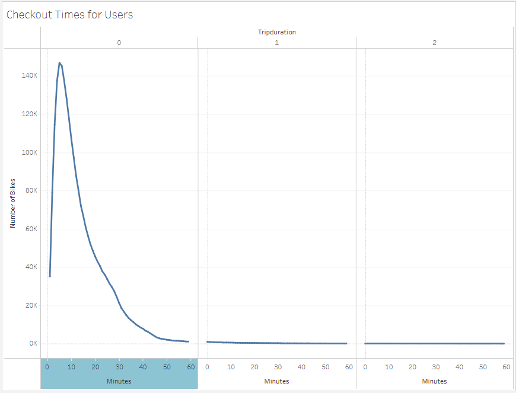
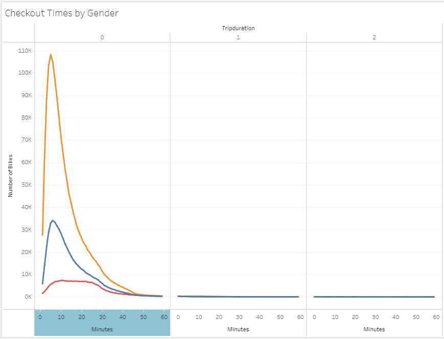

# Bikesharing
In this module, we learned how to use Tableau Public to generate visualizations.

## Overview
For this week's challenge, we were tasked with analyzing New York City bike sharing data for one month's worth of data. We imported a large CSV file of ride sharing data. We analyzed it in hopes of convincing investors that a similar business proposal would work in the city of Des Moines. Specifically, we performed some of the following:

1. We first loaded the CSV file into a Pandas data frame in Python and adjusted the trip duration column so that we can work with easier in Tableau. The work for this first part of the challenge can be found here: [Challenge.ipynb](NYC_Citibike_Challenge.ipynb)
2. We built several worksheets in Tableau to show the following:
    - Checkout Times for Users
    - Checkout Times by Gender
    - Trips by Weekday for Each Hour
    - Trips by Gender (Weekday per Hour)
    - User Trips by Gender by Weekday
3. We then built a story within Tableau to highlight our findings.

## Results
### Checkout Times for Users
The following visualization highlights the skew towards short rental. My thoughts are that we would want to focus on improving efficiency for short rentals. Almost all rentals are less than an hour and majority are less than twenty minutes.

### Checkout Times by Gender
The majority of riders are male. We should focus on reaching to non-male riders.

### Trips by Weekday for Each Hour
It is evident that the typical rush hours also translate to bike rentals. Additionally, Saturday and Sunday middle of the day are also fairly busy. We should make sure that we have enough bikes to satisfy the busy peaks.

### Trips by Gender (Weekday per Hour)
It appears that there is no correlation between time of rental and gender. Males continue to be the largest customer base and we should continue focusing on outreach to non-males.

### User Trips by Gender by Weekday
This visualization highlights the differences between customer and subscriber numbers. We should look to reach more customers.

### Average Trip Duration
Young riders are making up more of the longer duration trips. Continue targeting our young generations. We should be able to relate to young crowds with marketing related to importance of city bikes.

### Bike Utilization
Some bikes end up being used quite a bit more than others. Let's come up with a plan to rotate bikes between busy and less busy locations.

## Summary
We can generate quite impressive and helpful visualizations very quickly via Tableau. I think we can improve upon the business proposal by highlighting some of the insights we've found from examining the data so far. Two additional visualization that would be helpful as I was working with the data are:
1. Let's understand if there are certain location that contribute more to the busy peaks (rush hours). If so, we can come up with a strategy to ensure that there are more bikes in those areas for those busy times.
2. Another interesting visualization would be to see average distances traveled per trip when looking at it by starting location and time of day. We may see people going more towards the city in the morning, and then leaving the city after work.
